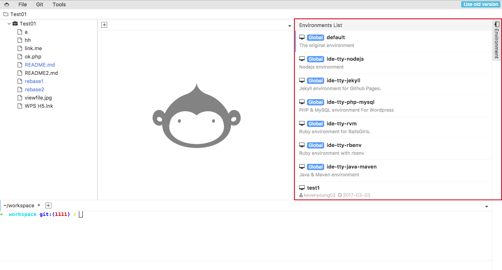

# WebIDE-ENV

Bring ENV to your Coding WebIDE.



## description
you can use this plugin to select the environment for your project container.


---

## State of the extension

----

## how to use

```yarn```
```yarn run dev```

----

## Change log
You can checkout all our changes in our [change log].

If you feel that there's some icon missing please report it to the Github repository!

## Versioning
vscode-icons follows [Semantic Versioning 2.0.0](http://semver.org/).

**Enjoy!**